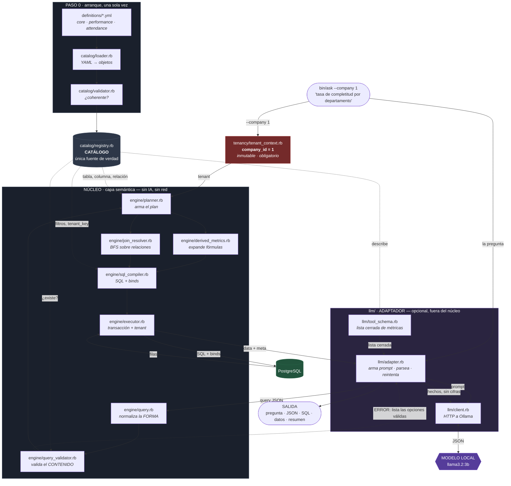

# Flujo completo, paso a paso

Trazando este comando real, de principio a fin:

```bash
bundle exec ruby bin/ask --company 1 "tasa de completitud por departamento"
```

---

## PASO 0 — Arranque: se carga y valida el catálogo

Ocurre **una sola vez**, antes de cualquier pregunta.

```
ARCHIVO   bin/ask
          → semantic_layer.rb :: Layer.load(definitions_path:, connection:)

ENTRA     "definitions" (ruta) + la conexión a Postgres
```

### 0.1 — Leer los YAML

```
ARCHIVO   catalog/loader.rb :: Loader#load

ENTRA     la carpeta definitions/

HACE      · Dir.glob de *.yml, ordenado → attendance.yml, core.yml,
            performance.yml
          · YAML.safe_load_file de cada uno
            (safe_load: un YAML es DATO, no debe poder instanciar objetos)
          · exige que cada archivo declare 'module'
          · por cada entidad llama a build_entity, que arma los objetos de
            valor definidos en catalog/definitions.rb:
                Entity · Dimension · Metric · Relationship · Filter
          · tenant_key se copia SIN valor por defecto, a propósito

SALE      un Registry (catalog/registry.rb) con 4 entidades:
            core.employees · core.departments
            performance.reviews · attendance.attendance_records
```

### 0.2 — Validar el catálogo

```
ARCHIVO   catalog/validator.rb :: Validator#validate!

ENTRA     el Registry recién construido

HACE      acumula TODOS los errores (no para en el primero) revisando:
          · cada entidad declara table y tenant_key   ← crítico para tenancy
          · dos entidades no comparten alias de SQL
          · cada relación apunta a una entidad que existe
          · ningún nombre de métrica/dimensión está repetido entre módulos
          · cada métrica usa una agregación válida y filtros que existen
          · cada dimensión temporal declara granularidades válidas
          · cada fórmula derivada referencia métricas reales
          · no hay ciclos entre métricas derivadas (recorrido en profundidad)

SALE      el mismo Registry, o ValidationError con la lista completa de fallos
          → si algo está mal, la aplicación NO ARRANCA
```

### 0.3 — Queda armado el objeto Layer

```
ARCHIVO   semantic_layer.rb :: Layer#initialize

SALE      un Layer que tiene dentro:
            @catalog   → el Registry validado
            @validator → Engine::QueryValidator
            @planner   → Engine::Planner
            @executor  → Engine::Executor
```

---

## PASO 1 — Se construye el contexto de empresa

```
ARCHIVO   bin/ask
          → tenancy/tenant_context.rb :: TenantContext#initialize

ENTRA     company_id: 1      ← viene del flag --company
                               (en una app real: Current.user.company_id)

HACE      · si es nil → TenantError
          · Integer(valor) → si no es entero, TenantError
          · si no es positivo → TenantError
          · freeze  ← el objeto queda inmutable de por vida

SALE      #<TenantContext company_id=1>  (congelado)
```

**Este objeto nunca llega al LLM.** `--company` se saca de `ARGV` antes de
armar la pregunta.

---

## PASO 2 — El adaptador arma el prompt

```
ARCHIVO   llm/adapter.rb :: Adapter#ask → #system_prompt

ENTRA     la pregunta: "tasa de completitud por departamento"
```

### 2.1 — Se genera la lista cerrada desde el catálogo

```
ARCHIVO   llm/tool_schema.rb :: ToolSchema#catalog_listing
          → catalog/registry.rb :: Registry#describe

ENTRA     el Registry

SALE      texto plano:

            MÉTRICAS DISPONIBLES:
              - total_attendance_days: Días registrados
              - present_days: Días presentes
              - attendance_rate: Tasa de asistencia (percent)
              - total_reviews: Evaluaciones totales
              - completed_reviews: Evaluaciones completadas
              - avg_performance_score: Score promedio de desempeño
              - completion_rate: Tasa de completitud (percent)

            DIMENSIONES DISPONIBLES:
              - attendance_date: Fecha de asistencia [granularidades: day, week, ...]
              - employee_name: Nombre del empleado
              - employee_active: Empleado activo
              - hire_date: Fecha de contratación [granularidades: month, quarter, year]
              - department: Departamento
              - review_status: Estado de la evaluación
              - review_period: Periodo evaluado [granularidades: quarter, month, year]

          (el orden es el de carga del catálogo, no alfabético)
```

Esta lista **se regenera en cada llamada** desde el catálogo. Agregar una
métrica a un YAML basta para que el modelo sepa que existe.

### 2.2 — Se ensambla el prompt

```
ARCHIVO   llm/adapter.rb :: #system_prompt

SALE      el listado de arriba
          + el formato de respuesta esperado
          + 4 ejemplos concretos de pregunta → JSON
          + las reglas ("metrics" obligatorio, nunca company_id, etc.)
```

---

## PASO 3 — Llamada al modelo

```
ARCHIVO   llm/client.rb :: OllamaClient#complete

ENTRA     system:  el prompt del paso 2
          user:    "tasa de completitud por departamento"
          json:    true
          options: { temperature: 0, num_predict: 400 }
                   ← temperatura 0 porque traducir a una lista cerrada no es
                     una tarea creativa; el tope de tokens corta a un modelo
                     que entre en bucle de repetición

HACE      POST http://localhost:11434/api/chat
          con "format": "json"   ← Ollama garantiza JSON válido al decodificar,
                                   no confiando en que el prompt se obedezca

SALE      un string:
            '{"metrics":["completion_rate"],"dimensions":["department"]}'
```

### 3.1 — Se limpia y parsea

```
ARCHIVO   llm/adapter.rb :: #parse_json

ENTRA     el string crudo (algunos modelos lo envuelven en ```json ... ```)

HACE      quita las cercas de markdown y hace JSON.parse

SALE      un Hash de Ruby:
            { "metrics" => ["completion_rate"], "dimensions" => ["department"] }
```

**Fíjate qué devolvió el modelo: el PEDIDO, no los datos.** Dijo qué
calcular. Los números todavía no existen.

---

## PASO 4 — Entra a la capa semántica

```
ARCHIVO   semantic_layer.rb :: Layer#run(query_input, tenant:)

ENTRA     el Hash del paso 3 + el TenantContext del paso 1
```

De aquí en adelante **no hay ninguna IA involucrada**. Es el mismo camino
que recorrería un dashboard.

### 4.1 — Normalizar la forma

```
ARCHIVO   engine/query.rb :: Query.parse

ENTRA     { "metrics" => ["completion_rate"], "dimensions" => ["department"] }

HACE      · acepta claves string o símbolo
          · "department" (string) y {"name":..., "granularity":...} (objeto)
            terminan en la MISMA estructura → DimensionRef
          · valida la FORMA, no el contenido:
              - el operador de cada filtro está en la lista blanca
                (eq ne gt gte lt lte in between) → si no, InvalidQueryError
              - 'between' exige exactamente 2 valores
              - 'limit' es entero positivo; si no viene, 1000 por defecto;
                techo duro de 10.000
          · NO consulta el catálogo: no sabe si completion_rate existe

SALE      #<Query
            metrics:    ["completion_rate"]
            dimensions: [DimensionRef(name: "department", granularity: nil)]
            filters:    []
            order_by:   []
            limit:      1000>
```

### 4.2 — Validar contra el catálogo

```
ARCHIVO   engine/query_validator.rb :: QueryValidator#validate!

ENTRA     el Query del paso 4.1 + el Registry

HACE      falla en el PRIMER error (corre en cada consulta; uno basta):
          · ¿hay al menos una métrica?
          · catalog.metric!("completion_rate") → ¿existe?
            si no: "metric 'x' does not exist. Available: a, b, c..."
          · para cada dimensión:
              - ¿es un campo reservado? (company_id, tenant, ...) → rechaza
                ANTES de preguntarle al catálogo
              - catalog.dimension!("department") → ¿existe?
              - si trae granularidad: ¿la dimensión es temporal?
                ¿declara esa granularidad?
          · las dimensiones de los filtros existen
          · order_by solo sobre métricas/dimensiones pedidas

SALE      el MISMO Query, sin modificar. Su único efecto es reventar si algo
          está mal.
```

### 4.3 — Planificar

```
ARCHIVO   engine/planner.rb :: Planner#plan

ENTRA     el Query validado + el TenantContext
```

**4.3.a — Expandir métricas derivadas**

```
ARCHIVO   engine/derived_metrics.rb :: DerivedMetrics#resolve

ENTRA     ["completion_rate"]

HACE      · catalog.metric!("completion_rate") → type: "derived",
            formula: "completed_reviews / total_reviews * 100"
          · tokenize(formula) con gramática CERRADA: solo identificadores,
            números, + - * / y paréntesis. Cualquier otro carácter revienta.
              [:identifier,"completed_reviews"] [:symbol,"/"]
              [:identifier,"total_reviews"] [:symbol,"*"] [:number,"100"]
          · Parser (descenso recursivo) → árbol:
                        Op("*")
                       /       \
                  Op("/")     Num(100)
                  /     \
            Ref(completed)  Ref(total)
          · inline(): si alguna referencia fuera derivada, se sustituye su
            árbol aquí (el catálogo ya garantizó que no hay ciclos)
          · refs(árbol) → ["completed_reviews", "total_reviews"]
            → las AGREGA a base_metrics aunque nadie las pidió

SALE      Resolution(
            base_metrics: [Metric(completed_reviews, count, filters:[completed]),
                           Metric(total_reviews,     count)],
            outputs:      [Output(name: "completion_rate", ast: <árbol>)])
```

**4.3.b — Determinar la entidad base**

```
HACE      entity_name de cada métrica base → ["performance.reviews"] × 2
          .uniq → una sola → OK

          Si hubiera dos distintas (ej: desempeño + asistencia) →
          InvalidQueryError explicando el fan-out.

SALE      base_entity = "performance.reviews"
```

**4.3.c — Resolver dimensiones y filtros contra el catálogo**

```
SALE      dimensions: [PlannedDimension(
                         definition: Dimension(name: "department",
                                               entity: "core.departments",
                                               column: "name"),
                         granularity: nil)]
          filters:    []
```

**4.3.d — Resolver el camino de JOINs**

```
ARCHIVO   engine/join_resolver.rb :: JoinResolver#resolve

ENTRA     base:    "performance.reviews"
          targets: ["core.departments"]   ← de las dimensiones Y los filtros

HACE      búsqueda en anchura (BFS) sobre el grafo de relaciones,
          recorriendo SOLO relaciones many_to_one:

          vuelta 1: performance.reviews → core.employees (employee_id = id)
                    ¿es el destino? no → sigue
          vuelta 2: core.employees → core.departments (department_id = id)
                    ¿es el destino? SÍ → devuelve el camino

          El camino más corto garantiza que no se arrastren tablas de más.
          Al no saber caminar en sentido inverso (uno a muchos), este
          resolvedor NO PUEDE producir fan-out.

SALE      [Join(performance.reviews → core.employees,   employee_id = id),
           Join(core.employees      → core.departments, department_id = id)]
```

**4.3.e — El plan completo**

```
SALE      Plan(
            base_entity:  "performance.reviews",
            base_metrics: [completed_reviews, total_reviews],
            outputs:      [Output(completion_rate, <árbol>)],
            dimensions:   [department],
            filters:      [],
            joins:        [2 joins],
            order_by:     [],
            limit:        1000,
            tenant:       #<TenantContext company_id=1>)
```

El consumidor pidió **1 métrica y 1 dimensión**. El plan tiene **2 métricas
base** (ninguna pedida), **2 JOINs** (ninguno escrito) y **un tenant**
(nunca enviado).

### 4.4 — Compilar a SQL

```
ARCHIVO   engine/sql_compiler.rb :: SqlCompiler#compile

ENTRA     el Plan

REGLA     identificadores y palabras clave → de la allow-list del catálogo
          valores del usuario              → siempre como bind ($1, $2, ...)

HACE      nivel interno (agrega):
          · dimensión department → departments.name AS department
            (si tuviera granularidad: DATE_TRUNC('quarter', col)::date)
          · métrica completed_reviews → COUNT(*) FILTER (WHERE ...)
            la expresión sale del YAML: "{{table}}.status = 'completed'"
            y {{table}} se reemplaza por el alias real: reviews
          · métrica total_reviews → COUNT(*)   ← SIN filtro
          · FROM performance_reviews reviews
          · los 2 JOINs, cada uno con la condición extra de tenant
          · WHERE reviews.company_id = $1     ← SIEMPRE, y siempre primero
          · GROUP BY 1

          nivel externo (proyecta):
          · department tal cual
          · la fórmula, renderizada por DerivedMetrics#to_sql sobre las
            columnas m_*, que YA están agregadas
          · LIMIT $2

SALE      Compiled(
            sql: "WITH base AS (
                    SELECT
                      departments.name AS department,
                      COUNT(*) FILTER (WHERE reviews.status = 'completed') AS m_completed_reviews,
                      COUNT(*) AS m_total_reviews
                    FROM performance_reviews reviews
                    INNER JOIN employees employees
                      ON employees.id = reviews.employee_id
                      AND employees.company_id = reviews.company_id
                    INNER JOIN departments departments
                      ON departments.id = employees.department_id
                      AND departments.company_id = employees.company_id
                    WHERE reviews.company_id = $1
                    GROUP BY 1
                  )
                  SELECT
                    department,
                    ((m_completed_reviews::numeric / NULLIF(m_total_reviews, 0)) * 100)
                      AS completion_rate
                  FROM base
                  LIMIT $2",
            binds: [1, 1000])
```

La fórmula vive **fuera** del CTE, donde solo existen columnas agregadas:
es estructuralmente imposible que se calcule fila a fila.

### 4.5 — Ejecutar

```
ARCHIVO   engine/executor.rb :: Executor#run

ENTRA     el Compiled + el Plan

HACE      · abre una transacción
          · SELECT set_config('app.current_company_id', '1', true)
            local:true → solo vive dentro de esta transacción.
            Se usa set_config (función) y no SET LOCAL porque acepta
            parámetros: ni el tenant se interpola.
          · exec_params(sql, binds)
          · aplica un type map de PG: los enteros llegan como Integer,
            los NUMERIC como BigDecimal, las fechas como Date
            (sin esto, todo llegaría como string)
          · cierra la transacción

SALE      Result(
            data: [{"department" => "Ingeniería", "completion_rate" => <BigDecimal 66.66...>},
                   {"department" => "Ventas",     "completion_rate" => <BigDecimal 87.5>}],
                  (sin redondear y sin orden garantizado: esta consulta no
                   declaró order_by)
            meta: { sql:        "WITH base AS (...)",
                    binds:      [1, 1000],
                    metrics:    ["completion_rate"],
                    dimensions: ["department"],
                    join_path:  ["performance.reviews", "core.employees",
                                 "core.departments"],
                    tenant:     { company_id: 1 },
                    row_count:  2,
                    elapsed_ms: 0.9 })
```

---

## PASO 4-bis — Si algo falló: auto-corrección

Si cualquier paso entre 4.1 y 4.5 levanta un `SemanticLayer::Error`, el
adaptador lo captura:

```
ARCHIVO   llm/adapter.rb :: Adapter#ask (rescue) → #user_prompt

ENTRA     el mensaje de error, que LISTA las opciones válidas:
            "metric 'avg_score' does not exist. Available:
             attendance_rate, avg_performance_score, completed_reviews, ..."

HACE      arma un nuevo prompt de usuario:
            <la pregunta original>
            "Tu respuesta anterior fue rechazada con este error: <error>
             Corrígela usando solo nombres de la lista."
          y vuelve al PASO 3. Hasta 3 intentos.

SALE      un JSON corregido, o un error final que incluye la última
          respuesta cruda del modelo para poder diagnosticar
```

Esto es lo que se imprime como bloque **(2b)** en la salida.

---

## PASO 5 — El LLM redacta el resultado

Al modelo **nunca se le entrega la tabla**. Ruby calcula los hallazgos y el
modelo solo los redacta.

### 5.1 — Ruby determina qué destaca (sin IA)

```
ARCHIVO   llm/adapter.rb :: #highlights

ENTRA     result.data  (las filas que devolvió Postgres)
          result.meta[:metrics] y [:dimensions]

HACE      de forma determinista, en Ruby puro, por cada métrica:
          · descarta las filas con valor nulo; si quedan menos de dos, o si
            todas valen lo mismo, no hay nada que destacar y se omite
          · junta TODOS los grupos empatados en el máximo y en el mínimo
            (quedarse con el primero declararía un ganador donde hay empate)
          · si más de MAX_GROUPS = 3 empatan en un extremo, eso no es un
            hallazgo sino la norma: dice "el resto queda por debajo"
          · nombra la métrica con su label del catálogo; los grupos salen
            tal cual de la fila
          · deliberadamente NO incluye ninguna cifra

SALE      una lista de hechos SIN números. Para esta consulta, una sola línea:

            En 'Tasa de completitud' destaca Ventas y queda atrás Ingeniería.
```

### 5.2 — El modelo lo redacta, sin escribir una sola cifra

```
ARCHIVO   llm/adapter.rb :: #summarize → OllamaClient#complete

ENTRA     la pregunta + los hechos del paso 5.1
          (NO las filas, NO la tabla, NI UN SOLO NÚMERO)
          options: { num_predict: 200 }

HACE      segunda llamada al modelo, con reglas ESTRICTAS:
            · NO escribas NINGÚN número, porcentaje ni cifra
            · usa únicamente los hechos entregados
            · máximo 2 frases, en prosa
            · describe qué destaca y qué se queda atrás, en palabras

          Un número equivocado en el resumen contradiría en silencio la
          tabla impresa tres líneas más arriba. A un modelo al que se le
          pasan cifras se le escapan otras inventadas; al que no recibe
          ninguna, no puede. El modelo hace lo único que hace mejor que el
          código —redactar— y las cifras viven solo donde están
          garantizadas: en la tabla.

SALE      "Ventas lidera la completitud de evaluaciones, mientras que
           Ingeniería se queda por detrás."
```

**El modelo no escribe ningún número en toda la respuesta.**

---

## PASO 6 — Se imprime todo

```
ARCHIVO   bin/ask

SALE      (1)  la pregunta, la empresa y el modelo usado
          (2)  el JSON declarativo que produjo el modelo
          (2b) los intentos rechazados, si los hubo
          (3)  el SQL generado + binds + camino de JOINs
          (4)  la tabla de datos
          (5)  el resumen en prosa

          Si los 3 intentos se agotan sin una consulta válida, bin/ask
          captura el error y en vez de todo lo anterior imprime un único
          bloque (!) con la pregunta y el motivo del rechazo, y sale con
          código 1. No se ejecuta SQL ni se devuelve ningún dato.
```

---

## Resumen: qué toca cada carpeta

| Carpeta | Cuándo participa | Qué aporta |
|---|---|---|
| `definitions/` | Paso 0 | El vocabulario declarado (dato, no código) |
| `catalog/` | Pasos 0, 2.1, 4.2, 4.3 | Carga, valida y responde "¿esto existe?" |
| `tenancy/` | Paso 1, 4.4, 4.5 | El contexto de empresa, obligatorio e inmutable |
| `engine/` | Pasos 4.1 a 4.5 | Normaliza, valida, planifica, compila y ejecuta |
| `llm/` | Pasos 2, 3, 4-bis, 5 | Traduce texto ↔ estructura. **Nunca ve SQL** |
| `bin/ask` | Pasos 1 y 6 | Orquesta la demo e imprime |
| `db/` | Paso 0 (conexión) | Andamiaje: esquema y datos de prueba |

## Los tres límites que nunca se cruzan

1. **El LLM nunca ve SQL ni lo escribe.** Produce el pedido; el compilador
   produce el SQL.
2. **El núcleo nunca ve texto libre.** Entra JSON, salen filas.
3. **El tenant nunca viaja por la pregunta.** Dice *quién* pregunta, no
   *qué* se pregunta.

---

# Diagrama

## Vista completa

GitHub renderiza este diagrama automáticamente al abrir el archivo.



## Vista de pájaro

Para leer en el editor, sin renderizar nada:

```
   👤  "tasa de completitud por departamento"        --company 1
        │                                                  │
        │                                                  ▼
        │                                    ┌──────────────────────────┐
        │                                    │ tenancy/                 │
        │                                    │ company_id = 1, congelado│
        │                                    └────────────┬─────────────┘
        ▼                                                 │
╔═══════════════════════════════════════════════════╗     │
║ llm/  ADAPTADOR   (opcional · fuera del núcleo)   ║     │
║                                                    ║     │
║  tool_schema.rb ──► adapter.rb ──► client.rb ──►🤖 ║     │
║        ▲                 ▲                    │    ║     │
║        │                 └────── JSON ────────┘    ║     │
╚════════╪═════════════════╪═════════════════════════╝     │
         │                 │                               │
    (lee el catálogo)      │ { "metrics": ["completion_rate"],
         │                 │   "dimensions": ["department"] }
         │                 ▼                               │
╔════════╪═══════════════════════════════════════════════╪═╗
║ NÚCLEO │  capa semántica   (sin IA · sin red)          │ ║
║        │                                                │ ║
║        │   engine/query.rb          normaliza la FORMA  │ ║
║        │          ▼                                     │ ║
║        ├──► engine/query_validator.rb  valida CONTENIDO │ ║
║        │          ▼         └─── error ──► de vuelta al 🤖
║        │   engine/planner.rb ◄───── tenant ─────────────┘ ║
║        │       ├──► derived_metrics.rb   expande fórmulas ║
║        │       └──► join_resolver.rb     BFS → camino JOIN║
║        │          ▼                                       ║
║        ├──► engine/sql_compiler.rb    SQL + binds ($1,$2) ║
║        │          ▼                                       ║
║        │   engine/executor.rb   transacción + set_config  ║
║        │          ▼                                       ║
╚════════╪══════════╪═══════════════════════════════════════╝
         │          ▼
   ┌─────┴──────┐  🗄️ PostgreSQL
   │  catalog/  │      │
   │  REGISTRY  │      ▼  filas
   │            │  { data: [...], meta: { sql, binds, join_path, ... } }
   │ ◄── definitions/*.yml         │
   └────────────┘                  ▼
                        🤖 redacta el resumen (solo redacta, no calcula)
                                   │
                                   ▼
          (1) pregunta  (2) JSON  (2b) auto-corrección
          (3) SQL       (4) datos (5) resumen
```

## Las tres fronteras, visualmente

```
        TEXTO LIBRE          │         ESTRUCTURA          │      SQL
   ─────────────────────────┼────────────────────────────┼──────────────
                             │                             │
    "¿cómo va el desempeño"  │  {"metrics": [...]}         │  SELECT ...
                             │                             │
        🤖 LLM               │        NÚCLEO               │   Postgres
                             │                             │
   ◄── el LLM vive aquí ───► │ ◄─── el núcleo vive aquí ──────────────►
                             │                             │
   el núcleo NUNCA           │                             │  el LLM NUNCA
   entra a esta zona         │                             │  entra a esta zona


              company_id  ──────►  entra SOLO por aquí  ──────┐
                                                               │
   nunca por la pregunta ✗      nunca por el JSON ✗            ▼
                                                        el compilador
                                                        lo inyecta
```
